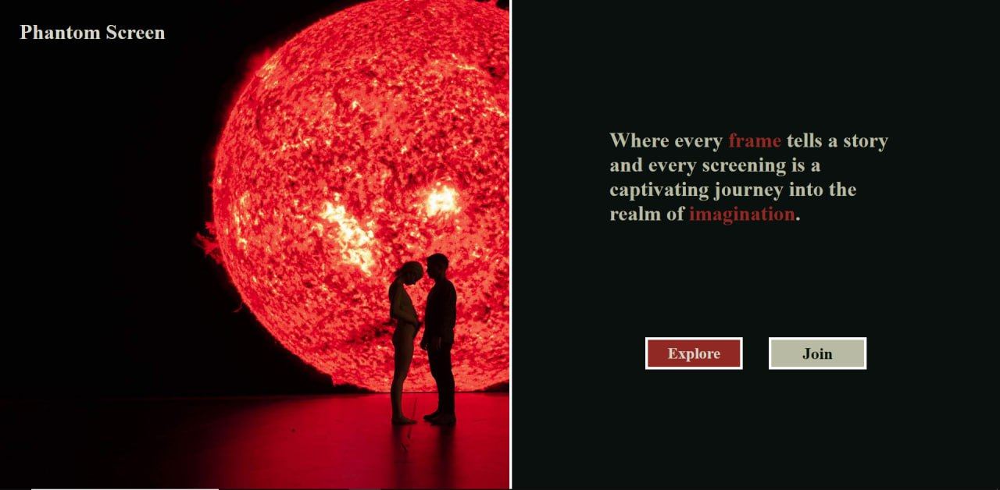

<p align="center">
    <a href="http://212.129.63.142:3000" target="_blank" rel="noopener">
        
    </a>
</p>

[Phantom Screan](http://212.129.63.142:3000) is a web application that provides a movie booking system
for the phantom theater.
The application allows users to explore currently showing movies in the theater,
view detailed information about each movie, purchase tickets,
and manage their bookings. With its cinematic-inspired design .

## Features

- **User authentication:** Sign up and login functionalities for users to create accounts and access personalized features.
- **Movie exploration:** Browse through a collection of movies. (also for guest users)
- **Top movies slide show:** Showcase a selection of top movies of theater in a visually appealing slideshow.
- **Movie schedule:** Select a specific date to see the available movies for that day.features.
- **Movie details:** View information about a movie, including its title, genre, duration , rating , description and director's name.(also for guest users)
- **Ticket booking:** Choose a movie, date, and time, select desired seats, and purchase tickets.
- **Tickets history:** View The history of tickets purchased by the user

### Installation and Setup

To set up the Phantom Screen project locally, follow these steps:

0. Make sure you have installed node.js on your machine

1. Clone the project repository

```sh
git clone git@github.com:kimKh4092/Movie-Booking.git
```

2. Install the required dependencies

```sh
npm install
```

3. start the project using

```sh
npm start
```

4. you can now see the application running on your localhost port 3000

```sh
localhost:3000
```

### Project Structure

- **src:** Contains the main source code of the application.
  - **components:** Includes reusable React components used throughout the application devided by each page ,also the parent components for the pages.
  - **pages:** Contains the main source code of the application.
  - **images:** Stores images and assets used in the application.
  - **styles:** Contains CSS files and styling related to the application's visual elements.
  - **utils:** Includes utility functions and helper modules used across the project.
  - **services:** Contains services used in the project , such as functions to call api point for each section

### Technologies Used

- **[React:](https://github.com/facebook/react)** A JavaScript library for building user interfaces.
- **[PocketBase:](https://github.com/pocketbase/pocketbase)** An Open Source backend-as-a-service platform used for backend and database with provicded api endpoints.

### User Interface

I aimed to create a visually appealing user interface, drawing inspiration from the world of cinema. Although there is still room for improvement, my focus was on designing an engaging and beautiful interface that captures the atmosphere of the silver screen. My goal was to provide users with a unique and enjoyable browsing experience, evoking the feeling of being in a movie theater.

> ⚠️ Please note that the website may not appear as intended on responsive pages.
> I apologize for any inconvenience caused. This limitation is a result of the project's time constraints and
> deadline. Additionally, there might be some latency issues due to the slow server. We appreciate your
> understanding in this matter.

_The name of the website is a tribute to the movie [Phantom of the Paradise](https://www.imdb.com/title/tt0071994/) directed by brian de palma . _
